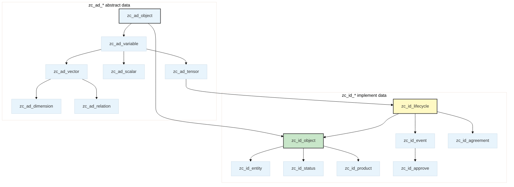

# Alioth

[](LICENSE)
[](Version)
[](https://www.postgresql.org/)

A **PostgreSQL table-inherited data model** grounded in group theory and commutative ontology. Alioth formalizes economic behavior as symmetric operations within a 4-dimensional orthogonal space `(Scene, Factor, Function, State)`, providing a mathematically rigorous foundation for enterprise data management.

---

## Files

| File | Description |
|---|---|
| `alioth.ddl` | Complete DDL (schema + all tables, types, functions, indexes, constraints) — concatenated production DDL ready to run on an empty database |
| `Version` | Current model version (v10.0.0), auto-updated on each publish |
| `003_seed_dimensions.sql` | Seed data for dimension tables (scene, factor, function categories) and category consensus tables |
| `003_seed_dimensions.meta.json` | Metadata descriptor for seed dimensions |

---

## Quick Start

### Prerequisites

- PostgreSQL 14+ with [Apache AGE](https://age.apache.org/) extension

### Setup

```bash
git clone https://github.com/CosmicTools9/Alioth.git
cd Alioth
psql -h localhost -U isahl -d isahl -f alioth.ddl
```

### Verification

```sql
-- Abstract type layer
SELECT relname FROM pg_class WHERE relname LIKE 'zc_ad_%' AND relkind = 'r' ORDER BY 1;

-- Business objects count
SELECT count(*) FROM pg_class WHERE relname LIKE 'zc_id_%' AND relkind = 'r';

-- Seed dimensions loaded
SELECT code, notice FROM zc_id_scene LIMIT 10;
```

---

## Model Architecture

### Inheritance Hierarchy

Alioth uses PostgreSQL table inheritance to build a layered hierarchy from abstract mathematical types to concrete business objects. Table name prefixes: `zc` (project prefix), `ad` = **abstract data**, `id` = **implement data**.



| Layer | Prefix | Root Table | Role | Field Characteristics |
|---|---|---|---|---|
| L0 Abstract | `zc_ad_` | `zc_ad_object` | Root of all objects | `id`, `created_at`, `updated_at` |
| L1 Semantic | `zc_ad_` | `zc_ad_variable` | Adds semantic identity | `code`, `notice`, `unit` |
| L2 Structure | `zc_ad_` | `zc_ad_scalar` / `zc_ad_vector` / `zc_ad_tensor` / `zc_ad_dimension` | Differentiation by mathematical structure |
| L3 Relation | `zc_ad_` | `zc_ad_relation` | Directed connection between two entities | `ref_left`, `ref_right` |
| L4 Implement | `zc_id_` | `zc_id_object` | **Business element root** — first-order inheritance defines categorical implementations |
| L5 Lifecycle | `zc_id_` | `zc_id_lifecycle` | Lifecycle trajectory for objects | `no`, `op_seq` |
| L6+ Leaf | `zc_id_` | `zc_id_order`, `zc_id_order-shipping`, … | Concrete business scenarios | All inherited fields + business-specific columns |

### 3D Coordinate System

Every lifecycle entity occupies a unique coordinate `(Scene, Factor, Function)` in the `isahl` space — all three dimensions are **fully orthogonal**:

| Dimension | DB Column | References | Meaning |
|---|---|---|---|
| Scene | `dk_scene` | `zc_id_scene` | Business context of the exchange (*where* the transaction occurs) |
| Factor | `dk_factor` | `zc_id_factor` | Subjects/mediums/objects participating in the exchange (*who* trades *what*) |
| Function | `dk_function` | `zc_id_function` | Operations at different stages and levels of the exchange (*how* the trade works) |

All three dimension bases inherit from `zc_ad_dimension`. Each dimension's `code` is auto-concatenated from a **category prefix + sequence symbol** (e.g., `JC` = system management), generated by triggers on INSERT/UPDATE.

### Five-Domain Completeness (LCGPF)

The Factor dimension is divided into five domains corresponding to the five indispensable perspectives of any complete exchange:

| Code | Domain | Elements | Economic Role |
|---|---|---|---|
| L | Labor | Participant subgroup | Who trades |
| C | Container | Medium/container subgroup | What carries value |
| G | Goods | Subject-matter subgroup | What is traded |
| P | Place | Location subgroup | Where trading |
| F | Finance | Process & information subgroup | How value flows |

Domain membership is classified via `ck_category` → `zc_id_cons-factor-cate.a_type_`. A complete exchange snapshot **must** cover all five domains (no symmetry breaking allowed), enforced by the AliothStudio inference engine.

### State Expression in Lifecycles

Discrete projections of a business object's lifecycle state are expressed through relation tables:

```
zc_id_lifecycle_r_primary-status → zc_id_status-*     Primary state (monotonic, e.g., born→dead)
zc_id_lifecycle_r_status         → zc_id_status       General state (bidirectional, e.g., active↔on leave)
zc_id_lifecycle_r_tags           → zc_id_tags         Tags
zc_id_lifecycle_r_category       → zc_id_category     Categories
```

---

## Naming Conventions

### Table-Level

| Suffix | Relationship Type | Example |
|---|---|---|
| `{entity}_r_{target}` | One-to-many reference table | `zc_id_lifecycle_r_status` |
| `{entity}_rr_{target}` | Many-to-many bridge table | `zc_id_bom_rr_item` |

Reference tables carry `ref_left` (referencer) and `ref_right` (referenced) columns.

### Column-Level

| Prefix | Meaning | Example |
|---|---|---|
| `qk_*` | Scalar reference key → `zc_id_scalar-*` system | `qk_price`, `qk_amount` |
| `fk_*` | Foreign key reference | `fk_country` |
| `sk_*` | Unit reference | `sk_unit` (points to measurement unit table) |
| `ck_*` | Category/classification reference | `ck_category` |
| `tk_*` | Tag reference | `tk_batch_no` (single-select tag) |
| `lk_*` | Level/grade reference | `lk_level` |

> The `_f_` and `_t_` columns are auto-derived from the `dk_function.code` prefix (six forms: `!.` / `!_` / `↑.` / `↑_` / `↓.` / `↓_` → Creative / Design / Implement × Paradigm / Instance) and are never exposed in business-layer DTOs.

---

## Key Design Decisions

### ID Generation

| Table Type | Function |
|---|---|
| `zc_id_lifecycle` and all its children | `isahl.gen_next_zuid()` — globally unique IDs |
| Non-lifecycle business tables | `isahl.gen_next_uid(table_code)` — deterministic IDs |
| `isahl_meta` metadata tables | `BIGSERIAL` |

Inherited tables bind their own generators via separate `ALTER COLUMN id SET DEFAULT` statements to avoid conflicts in multiple-inheritance scenarios.

### Scalar Reference Model

All measurable continuous quantities (amounts, dates, quantities, prices) are **not stored as native types** on business tables. Instead, they pass through scalar reference tables:

```
business_table.qk_price (bigint) → zc_id_scalar-price.id → zc_id_scalar-price.mark (numeric)
business_table.qk_date  (bigint) → zc_id_scalar-date.id  → zc_id_scalar-date.date  (timestamptz)
```

| Prefix | Scalar Table | Actual Value Column |
|---|---|---|
| `qk_date` | `zc_id_scalar-date` | `date` (timestamptz) |
| `qk_amount` | `zc_id_scalar-amount` | `mark` (numeric) |
| `qk_price` | `zc_id_scalar-price` | `mark` (numeric) |
| `qk_qty` | `zc_id_scalar-common` | `mark` (numeric) |
| Other `qk_*` | `zc_id_scale` inheritance hierarchy | `mark` (numeric) |

**Hard constraint**: All `qk_*` columns are `bigint` in DDL. Never define them as `Decimal`, `DateTime`, or `String` — the actual typed value lives on the referenced scalar row.

### Column Writeability

| Category | Writeability | Typical Columns |
|---|---|---|
| 🚫 System-generated | Invisible & unwritable | `id`, `created_at`, `updated_at`, `deleted_at` |
| 🔒 Dimension/trigger-derived | Not exposed in DTOs | `number`, `domain_`, `_f_`, `_t_`, `dk_*`, `paths` |
| ✅ User-writable | Directly in DTOs | `notice`, `code`, `comments`, `qk_*`, `fk_*`, `ck_*`, `tk_*` |

---

## Model Publishing

The `alioth.ddl` in this repository is auto-generated by [AliothStudio](https://github.com/aliothstudio)'s model publishing pipeline:

1. Meta platform model publish → `pg_dump --schema isahl`
2. Post-processed to pure CREATE/ALTER form
3. Multi-inheritance table `id` column DEFAULTs refined (extracted inline, then applied via ALTER SET DEFAULT)
4. Pushed to this repository

Each publish automatically updates `alioth.ddl` and `Version`. Versioning follows [SemVer](https://semver.org/).

---

## Contributing

The Alioth model evolves through the [AliothStudio](https://github.com/aliothstudio) platform. Report DDL compatibility issues or suggest model improvements via [Issues](https://github.com/CosmicTools9/Alioth/issues).

---

## License

[MIT](LICENSE) © Yuqi Technology & CosmicTools Team

---

**Alioth** — A mathematically-grounded enterprise data ontology

Built with heart by the [CosmicTools](https://cosmic-tools.ltd) team

Version: v10.0.0 | Last updated: June 2026
