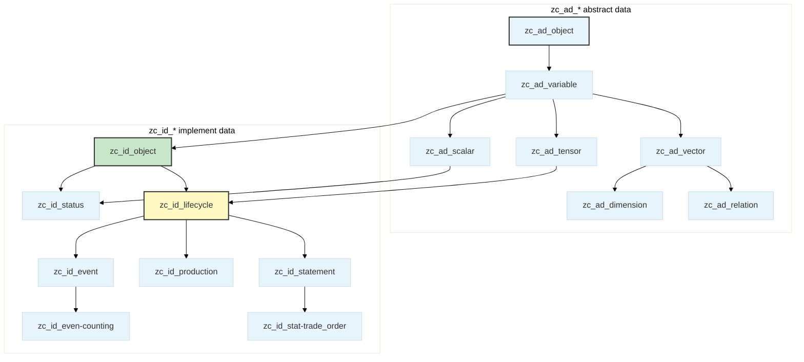

# Alioth

[](LICENSE)
[](https://www.postgresql.org/)
[](README.zh-CN.md)

A **PostgreSQL table-inherited data model** grounded in category theory and commutative ontology. Alioth formalizes economic behavior as morphisms of an *exchange category*: reversible trades form a **groupoid** equipped with an involutive symmetry functor (every reversible trade has a mirror-image counter-trade, `S² = id`), and every business entity occupies a unique point in a 4-dimensional orthogonal space `(Scene, Factor, Function, Status)` — a mathematically rigorous foundation for enterprise data management.

Latest model version is anchored at [`latest.json`](latest.json). The latest publish (`v10.0.27`, 2026-09-17) carries **972 inherited tables** (13 `zc_ad_*` abstract + 959 `zc_id_*` implement) and **254 seed tables**, verified by a full rebuild on a dedicated verification database.

---

## Repository Layout

Published models are stored **per version** in this repository. Each publish writes a versioned directory `v{major}.{minor}.{patch}/`:

```
Alioth/
├── latest.json                     # Latest version anchor: version, published_at, per-table seed row counts, file list
└── v10.0.27/                       # One directory per released version (SemVer)
    ├── 001_schema.sql              # CREATE SCHEMA IF NOT EXISTS isahl
    ├── 002_isahl_tables.sql        # isahl schema structure only (pure CREATE/ALTER, post-processed; 972 tables)
    ├── seed-dimensions.sql         # Seed data for the 254 dimension/category/status/dictionary tables
    ├── seed-dimensions.meta.json   # Expected row counts per seed table (for verification)
    ├── seed-model-contract.sql     # Model-level seed contract (declared seed table set, idempotent)
    ├── model-contract.json         # Machine-readable model contract of this publish
    ├── verify-report.json          # Rebuild verification report (written after a verification run)
    └── README.md                   # Per-version readme (export timestamp, pg_dump version)
```

---

## Quick Start

### Prerequisites

- PostgreSQL 14+
- The `isahl_meta` type definitions referenced by `isahl` columns must exist (enums/domains are injected from the source database during verification; a standard deployment ships them together with the schema).

### Setup

```bash
git clone https://github.com/CosmicTools9/Alioth.git
cd Alioth
VERSION=$(jq -r .version latest.json)   # or pick a concrete version directory
psql "$DATABASE_URL" -f "$VERSION/001_schema.sql"
psql "$DATABASE_URL" -f "$VERSION/002_isahl_tables.sql"
psql "$DATABASE_URL" -f "$VERSION/seed-dimensions.sql"
psql "$DATABASE_URL" -f "$VERSION/seed-model-contract.sql"
```

The files must be applied **in order**: schema → tables → seed data → seed contract.

### Verification

```sql
-- Table counts (expected for v10.0.27)
SELECT count(*) FROM pg_tables WHERE schemaname='isahl' AND tablename LIKE 'zc\_ad\_%';  -- 13
SELECT count(*) FROM pg_tables WHERE schemaname='isahl' AND tablename LIKE 'zc\_id\_%';  -- 959

-- Seed dimensions loaded
SELECT code, notice FROM isahl.zc_id_scene LIMIT 10;
```

---

## Model Architecture

### Inheritance Hierarchy

Alioth uses PostgreSQL table inheritance to build a layered hierarchy from abstract mathematical types to concrete business objects. Table name prefixes: `zc` (project prefix), `ad` = **abstract data**, `id` = **implement data**.



| Layer | Prefix | Root Table | Role | Field Characteristics |
|---|---|---|---|---|
| L0 Abstract | `zc_ad_` | `zc_ad_object` | Root of all objects | `id`, `created_at`, `updated_at` |
| L1 Semantic | `zc_ad_` | `zc_ad_variable` | Adds semantic identity | `code`, `notice` |
| L2 Structure | `zc_ad_` | `zc_ad_scalar` / `zc_ad_vector` / `zc_ad_tensor` / `zc_ad_dimension` | Differentiation by mathematical structure | `mark`, `precision_`（scalar）等 |
| L3 Relation | `zc_ad_` | `zc_ad_relation` | Directed connection between two entities | `ref_left`, `ref_right` |
| L4 Implement | `zc_id_` | `zc_id_object` | **Business element root** — first-order inheritance defines categorical implementations | `o_number`, `comments` |
| L5 Lifecycle | `zc_id_` | `zc_id_lifecycle` | Lifecycle trajectory + ontology coordinates | `dk_scene` / `dk_factor` / `dk_function`, `_f_` / `_t_`, `tpl_id`, `o_number` |
| L6+ Leaf | `zc_id_` | `zc_id_stat-trade_order`, `zc_id_orde-land`, `zc_id_even-counting`, … | Concrete business scenarios | All inherited fields + business-specific columns |

### 3D Coordinate System

Every lifecycle entity occupies a unique coordinate `(Scene, Factor, Function)` in the `isahl` space — the three dimensions are **fully orthogonal** (a product category: each dimension varies independently):

| Dimension | DB Column | References | Meaning |
|---|---|---|---|
| Scene | `dk_scene` | `zc_id_scene` | Business context of the exchange (*where* the transaction occurs) |
| Factor | `dk_factor` | `zc_id_factor` | Subjects/mediums/objects participating in the exchange (*who* trades *what*) |
| Function | `dk_function` | `zc_id_function` | Operations at different stages and levels of the exchange (*how* the trade works) |

All three dimension bases inherit from `zc_ad_dimension`. Each dimension's `code` is auto-concatenated from a **category prefix + sequence symbol** (e.g., `JC` = system management), generated by triggers on INSERT/UPDATE.

### Five-Domain Completeness (LCGPF)

The Factor dimension is divided into five domains corresponding to the five indispensable perspectives of any complete exchange:

| Code | Domain | Elements | Economic Role |
|---|---|---|---|
| L | Labor | Participant subgroup | Who trades |
| C | Container | Medium/container subgroup | What carries value |
| G | Goods | Subject-matter subgroup | What is traded |
| P | Place | Location subgroup | Where trading |
| F | Finance | Process & information subgroup | How value flows |

Domain membership is derived via `ck_category` → `zc_id_cons-factor-cate.a_type_`. A complete exchange snapshot **must** cover all five domains — formally, the image of the domain map covers `{L, C, G, P, F}` (no symmetry breaking allowed), enforced by the model inference engine at generation time.

### State Expression in Lifecycles

Discrete projections of a business object's lifecycle state are expressed through relation tables (the entity row itself carries no status column):

```
zc_id_lifecycle_r_primary-status → zc_id_stus-*       Primary state (domain status leaf; monotonic, e.g., born→dead)
zc_id_lifecycle_r_status         → zc_id_status       General state (bidirectional, e.g., active↔on leave)
zc_id_lifecycle_r_tags           → zc_id_tags         Tags
zc_id_lifecycle_r_category       → zc_id_category     Categories
```

The primary state chain is a total order — discrete logical time; `status_date` aligns it to physical time. Past and future time slices are mirror images around *now*: `zc_id_event` (happened) ↔ `zc_id_task` (to happen), with completion flipping a task slice into an event slice.

---

## Naming Conventions

### Table-Level

| Suffix | Relationship Type | Example |
|---|---|---|
| `{entity}_r_{target}` | One-to-many relation table (`ref_right` unique: each child has exactly one parent) | `zc_id_lifecycle_r_status` |
| `{entity}_rr_{target}` | Many-to-many bridge table (a span: both ends repeatable) | `zc_id_bom_rr_item` |

Relation tables carry `ref_left` (referencer) and `ref_right` (referenced) columns.

### Column-Level

| Prefix | Meaning | Example |
|---|---|---|
| `dk_*` | Ontology coordinate → `zc_ad_dimension` family | `dk_scene`, `dk_factor`, `dk_function` |
| `qk_*` | Scalar reference key → `zc_id_scale` hierarchy (`zc_id_scal-*` leaves) | `qk_price`, `qk_amount` |
| `fk_*` | Lifecycle entity reference | `fk_country` |
| `sk_*` | Unit reference | `sk_unit` (points to measurement unit table) |
| `ck_*` | Category/classification reference | `ck_category` |
| `tk_*` | Tag reference | `tk_batch_no` (single-select tag) |
| `lk_*` | Level/grade reference | `lk_level` |
| `tpl_id` | Instance → paradigm bridge | fixed column name |

> The `_f_` and `_t_` columns are auto-derived from the `dk_function.code` prefix (six forms: `!.` / `!_` / `↑.` / `↑_` / `↓.` / `↓_` → Creative / Design / Implement × Paradigm / Instance — a stage × abstraction-level product structure) and are never exposed in business-layer DTOs.

---

## Key Design Decisions

### ID Generation

| Table Type | Function |
|---|---|
| `zc_id_lifecycle` and all its children | `isahl.gen_next_zuid()` — globally unique IDs |
| Non-lifecycle business tables | `isahl.gen_next_uid(table_code)` — deterministic IDs |
| `isahl_meta` metadata tables | `BIGSERIAL` |

Inherited tables bind their own generators via separate `ALTER COLUMN id SET DEFAULT` statements to avoid conflicts in multiple-inheritance scenarios.

### Scalar Reference Model

All measurable continuous quantities (amounts, dates, quantities, prices) are **not stored as native types** on business tables. Instead, they pass through scalar reference tables — a value-object externing scheme where equal values share one row:

```
business_table.qk_price (bigint) → zc_id_scal-price.id → zc_id_scal-price.mark (numeric)
business_table.qk_date  (bigint) → zc_id_scal-date.id  → zc_id_scal-date.date  (timestamptz)
```

| Prefix | Scalar Table | Actual Value Column |
|---|---|---|
| `qk_date` | `zc_id_scal-date` | `date` (timestamptz) |
| `qk_amount` | `zc_id_scal-amount` | `mark` (numeric) |
| `qk_price` | `zc_id_scal-price` | `mark` (numeric) |
| `qk_qty` | `zc_id_scal-common` | `mark` (numeric) |
| Other `qk_*` | `zc_id_scale` inheritance hierarchy | `mark` (numeric) |

**Hard constraint**: All `qk_*` columns are `bigint` in DDL. Never define them as `Decimal`, `DateTime`, or `String` — the actual typed value lives on the referenced scalar row (with `sk_unit` unit and `precision_` precision).

### Column Writeability

| Category | Writeability | Typical Columns |
|---|---|---|
| 🚫 System-generated | Invisible & unwritable | `id`, `created_at`, `updated_at`, `deleted_at` |
| 🔒 Dimension/trigger-derived | Not exposed in DTOs | `o_number`, `domain_`, `_f_`, `_t_`, `dk_*`, `paths` |
| ✅ User-writable | Directly in DTOs | `notice`, `code`, `comments`, `qk_*`, `fk_*`, `ck_*`, `tk_*` |

---

## Model Publishing

Each version directory is produced by the model publishing pipeline:

1. Export the `isahl` schema from the authoritative database via `pg_dump --schema-only` (plus data-only dumps of the 254 seed tables).
2. Post-process to **pure CREATE/ALTER** form: strip runtime-only statements, inline `id` column DEFAULTs are extracted and re-applied as `ALTER TABLE ... ALTER COLUMN id SET DEFAULT isahl.gen_next_uid(...)` statements, ordered topologically by inheritance depth so every inherited table binds its own generator.
3. Write the versioned directory under this repository (including the machine-readable `model-contract.json` / `seed-model-contract.sql`) and update `latest.json`.
4. **Rebuild verification** (non-blocking): on a dedicated clean verification database, drop `isahl` / `isahl_auth` / `isahl_audit` and re-apply the SQL files in order with `ON_ERROR_STOP=1`, then assert seed-table row counts (per-table round-trip against the publish snapshot), `gen_next_uid` uniqueness (0 conflicts, 0 missing), and structural round-trip (972-table set identical to source). The report is persisted as `verify-report.json` in the version directory; a passing rebuild marks the version `verified`.

Versioning follows [SemVer](https://semver.org/). Versions never decrease; the floor is `v10.0.0`. Publish records (version, description, output directory, file list, status) are tracked in `isahl_meta.model_publish_records`.

---

## Contributing

The Alioth model evolves through versioned releases. Report DDL compatibility issues or suggest model improvements via [Issues](https://github.com/CosmicTools9/Alioth/issues).

---

## License

[MIT](LICENSE) © 2025-2026 宇器科技(CosmicTools.ltd) & CosmicTools Team

---

**Alioth** — A mathematically-grounded enterprise data ontology

Built with heart by the [CosmicTools](https://cosmic-tools.ltd) team
