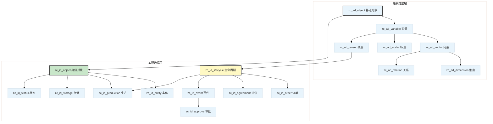

# Alioth

[](LICENSE)
[](Version)
[](https://www.postgresql.org/)

**企业级数据本体建模框架** — 基于群论与范畴论构建的 PostgreSQL 表继承体系，覆盖交易主体、对象、媒介、过程、信息、状态六大范畴。

---

## 文件说明

|文件|内容|
|---|---|
|`alioth.ddl`|**完整 DDL**（schema + 所有表、类型、函数、约束），可直接导入|
|`Version`|模型版本号，与 `alioth.ddl` 头部一致|

> `alioth.ddl` 由 `pg_dump --schema isahl` 生成，经过后处理过滤为纯 `CREATE` / `ALTER` 语句，在空数据库中可直接执行。

---

## 快速开始

### 前置条件

- PostgreSQL 14+
- 已创建 `isahl` 角色和 `isahl` 数据库：

```sql
CREATE ROLE isahl WITH LOGIN;
CREATE DATABASE isahl OWNER isahl;
```

### 导入

```bash
git clone https://github.com/CosmicTools9/Alioth.git
cd Alioth
psql -h localhost -U isahl -d isahl -f alioth.ddl
```

### 验证

```sql
-- 查看抽象类型层
SELECT relname FROM pg_class WHERE relname LIKE 'zc_ad_%' AND relkind = 'r' ORDER BY 1;

-- 查看业务对象数量
SELECT count(*) FROM pg_class WHERE relname LIKE 'zc_id_%' AND relkind = 'r';
```

---

## 模型结构

### 继承层次

Alioth 采用 PostgreSQL 表继承机制，从抽象数学类型逐步特化到具体业务对象：



|层次|类型|字段特征|
|---|---|---|
|L0|`zc_ad_object`|`id bigint`, `created_at`, `updated_at`|
|L1|`zc_ad_variable`|+ `code`, `notice`, `unit` 等语义字段|
|L2|`zc_ad_scalar` / `zc_ad_vector` / `zc_ad_tensor` / `zc_ad_dimension`|按数学结构分化（标量、向量、张量、维度）|
|L3|`zc_ad_relation`|+ `ref_left`, `ref_right` 关系字段|
|L4|`zc_id_object`|**业务要素实现根** — 继承自 L0~L3，携带组织维度绑定|
|L5|`zc_id_lifecycle`|+ `no`（编号）、`op_seq`（操作序列）— 支持状态机|
|L6+|具体业务表|`zc_id_order`, `zc_id_orde-shipping`, `zc_id_prod-sales` 等|

### 六大范畴

模型按经济活动维度组织为六个范畴，每张业务表属于其中一个：

|范畴|根表|关键子表（部分）|
|---|---|---|
|**交易主体** Entity|`zc_id_entity`|`zc_id_subjects`, `zc_id_orga-corporation`, `zc_id_bank-commercial`|
|**交易对象** Product|`zc_id_product`|`zc_id_prod-sales`, `zc_id_prod-combine`, `zc_id_inventory`|
|**交易媒介** Storage|`zc_id_storage`|`zc_id_stor-account`, `zc_id_place`, `zc_id_contact_infos`|
|**交易过程** Lifecycle|`zc_id_lifecycle`|`zc_id_order`, `zc_id_plan`, `zc_id_production`, `zc_id_operation`|
|**交易信息** Document|`zc_id_document`|`zc_id_invoice`, `zc_id_contract`, `zc_id_formula`|
|**交易状态** Status|`zc_id_status`|`zc_id_version`, `zc_id_stus-payment`, `zc_id_stus-billing`|

### 表命名约定

关系表通过表名后缀标识：

|后缀|含义|示例|
|---|---|---|
|`_r_`|多对一关系表|`zc_id_lifecycle_r_status` — 生命周期引用状态|
|`_rr_`|多对多关系表|`zc_id_bom_rr_item` — BOM 与物料多对多|

### 列前缀约定

业务表的列通过前缀区分用途：

|前缀|含义|示例|
|---|---|---|
|`qk_`|标量引用键|`qk_price` — 价格引用（指向标量表）|
|`fk_`|外键|`fk_country` — 国家外键|
|`sk_`|序列/流水号|`sk_no` — 流水编号|
|`ck_`|分类/类别键|`ck_type` — 类型分类|

> 另外 `_f_` 和 `_t_` 列由 `dk_function` 触发器自动派生，不在 DTO 中暴露。

### ID 生成

所有表的 `id` 列通过 `gen_next_uid(table_code)` 生成全局唯一 ID，继承表通过后置 `ALTER COLUMN id SET DEFAULT` 独立绑定自己的生成器，确保即使在多继承场景下也不会冲突。

---

## 理论背景

Alioth 的理论基础是**交易对称性**——将经济行为形式化为群论中的对称操作：

- 一笔交易 $T: A \to B$ 必然对应一笔逆交易 $T^{-1}: B \to A$
- 系统的总价值守恒（$\sum endowment = \text{constant}$）
- 经济关系在范畴论框架下保持结构不变性

这种数学严谨性使得 Alioth 能够：
- **形式化验证**交易的完整性和一致性
- **自动派生**双边的记账分录
- **类型安全**地组合任意复杂的经济行为

关于数学模型的详细推导，参见 `docs/theory.md`（规划中）。

---

## 版本历史

Alioth 通过持续迭代演进数据模型。本仓库包含最新的完整 DDL 文件，通过 `alioth.ddl` 即可获得当前最新表结构。

各版本的详细差异由 [AliothStudio](https://github.com/aliothstudio) 平台的模型发布功能自动追踪。

---

## 贡献

欢迎通过 [Issues](https://github.com/CosmicTools9/Alioth/issues) 提交：
- 模型改进建议（新增实体、关系调整、字段补充）
- DDL 兼容性问题
- 文档错误

代码贡献请 Fork 后提交 PR。更多信息见 [CONTRIBUTING.md](CONTRIBUTING.md)（规划中）。

---

## 许可证

[MIT](LICENSE) © 宇器科技 & CosmicTools 团队

---

**Alioth** — 基于数学对称性的企业级数据建模框架

由 [CosmicTools](https://cosmic-tools.ltd) 团队用爱打造

版本：v10.0.7 | 最后更新：2026年07月
