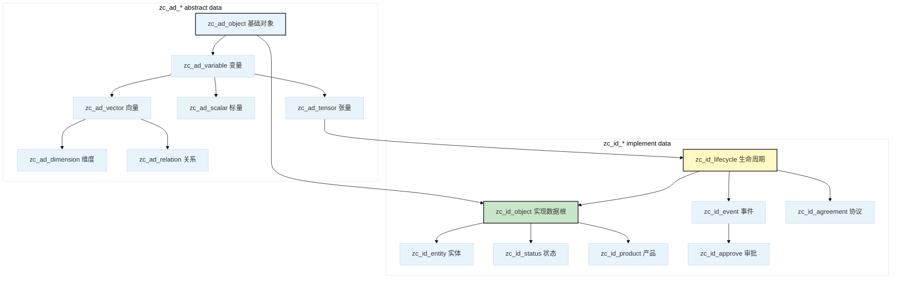

# Alioth

[](LICENSE)
[](Version)
[](https://www.postgresql.org/)

基于群论与交换本体论的 **PostgreSQL 表继承数据模型**。将经济行为形式化为对称操作，通过三维正交坐标 `(Scene, Factor, Function)` 加上状态维构成完整的本体空间。

本文档说明如何使用 `alioth.ddl` 部署模型，以及模型的架构设计。

---

## 文件说明

|文件|内容|
|---|---|
|`alioth.ddl`|完整 DDL（schema + 所有表、类型、函数、索引、约束），由 `pg_dump` 生成并后处理为纯 CREATE/ALTER 形式|
|`Version`|当前模型版本号，每次发布自动更新|

`alioth.ddl` 在空数据库中可直接执行，无需任何预处理。

---

## 快速开始

### 前置条件

- PostgreSQL 14+
- 已创建 `isahl` 角色和数据库：

```sql
CREATE ROLE isahl WITH LOGIN;
CREATE DATABASE isahl OWNER isahl;
```

### 导入

```bash
git clone https://github.com/CosmicTools9/Alioth.git
cd Alioth
psql -h localhost -U isahl -d isahl -f alioth.ddl
```

### 验证

```sql
-- 抽象类型层
SELECT relname FROM pg_class WHERE relname LIKE 'zc_ad_%' AND relkind = 'r' ORDER BY 1;

-- 业务对象数量
SELECT count(*) FROM pg_class WHERE relname LIKE 'zc_id_%' AND relkind = 'r';
```

---

## 模型架构

### 继承层次

Alioth 通过 PostgreSQL 表继承构建从抽象数学类型到具体业务对象的层次结构。
表名前缀约定：`zc` 为项目前缀，`ad` = **abstract data**（抽象数据），`id` = **implement data**（实现数据）。



|层|前缀|基表|职责|字段特征|
|---|---|---|---|---|
|L0 抽象|`zc_ad_`|`zc_ad_object`|所有对象的根|`id`, `created_at`, `updated_at`|
|L1 语义|`zc_ad_`|`zc_ad_variable`|为对象添加语义标识|`code`, `notice`, `unit`|
|L2 结构|`zc_ad_`|`zc_ad_scalar` / `zc_ad_vector` / `zc_ad_tensor` / `zc_ad_dimension`|按数学结构分化|
|L3 关系|`zc_ad_`|`zc_ad_relation`|两实体的有向连接|`ref_left`, `ref_right`|
|L4 实现|`zc_id_`|`zc_id_object`|**业务要素根** — 一阶继承表定义分类实现|继承 L0~L3 的全部字段|
|L5 生命周期|`zc_id_`|`zc_id_lifecycle`|为对象赋予运作轨迹|`no`, `op_seq`|
|L6+ 叶表|`zc_id_`|`zc_id_order`, `zc_id_orde-shipping`, …|具体业务场景|继承链上全部字段 + 业务专有字段|

### 三维坐标体系

每个生命周期实体在 `isahl` 空间中占据唯一坐标点 `(Scene, Factor, Function)`，三维**完全正交**：

|维度|DB 列|指向|含义|
|---|---|---|---|
|Scene 场景|`dk_scene`|`zc_id_scene`|交换发生的业务上下文（在哪交易）|
|Factor 要素|`dk_factor`|`zc_id_factor`|参与交换的主体/媒介/标的物（谁在交易，交易什么）|
|Function 功能|`dk_function`|`zc_id_function`|交换中不同阶段不同层次的操作（怎么交易）|

三个维度的基表都是 `zc_ad_dimension`。每个维度的 `code` 由**类目前缀 + 序号符号**自动拼接（如 `JC` = 系统管理），由触发器在 INSERT/UPDATE 时自动生成。

### 五领域完备性

Factor 维度按要素类型分为五个子域，对应一次完整交换不可或缺的五个视角：

|领域码|领域|要素|经济角色|
|---|---|---|---|
|L|人|参与者子群|谁在交易|
|C|箱|媒介/容器子群|用什么承载|
|G|货|标的物子群|交易什么|
|P|场|场所子群|在哪交易|
|F|财|过程与信息子群|怎么流转|

领域归属于 `ck_category` → `zc_id_cons-factor-cate.a_type_`。一次完整的交换快照必须覆盖全部五个领域（不允许对称性破缺），由 AliothStudio 平台的推理引擎自动补全缺失领域。

### 生命周期的状态表达

业务对象在整个生命周期中的状态的离散投影，通过关系表实现：

```
zc_id_lifecycle_r_primary-status → zc_id_stus-*  主状态（单向演进，如生→死）
zc_id_lifecycle_r_status         → zc_id_status   通用状态（双向，如在职↔休假）
zc_id_lifecycle_r_tags           → zc_id_tags     标签
zc_id_lifecycle_r_category       → zc_id_category 分类
```

---

## 命名约定

### 表级

|后缀|关系类型|示例|
|---|---|---|
|`{entity}_r_{target}`|一对多引用表|`zc_id_lifecycle_r_status`|
|`{entity}_rr_{target}`|多对多桥接表|`zc_id_bom_rr_item`|

关系表持有 `ref_left` 和 `ref_right`，分别表示引用方和被引用方的 ID。

### 列级

|前缀|含义|示例|
|---|---|---|
|`qk_*`|标量引用键 → `zc_id_scal-*` 体系|`qk_price`（价格引用）、`qk_amount`（金额引用）|
|`fk_*`|外键引用|`fk_country`|
|`sk_*`|单位引用|`sk_unit`（指向计量单位表）|
|`ck_*`|分类/类目引用|`ck_category`（指向类目体系）|
|`tk_*`|标签引用|`tk_batch_no`（单选标签）|
|`lk_*`|等级引用|`lk_level`|

> `_f_` 和 `_t_` 列由 `dk_function.code` 前缀自动派生（六种：`!.` / `!_` / `↑.` / `↑_` / `↓.` / `↓_` → 创意/设计/实现 × 范例/实例），不在业务层的 DTO 中暴露。

---

## 关键设计

### ID 生成

|表类型|函数|
|---|---|
|`zc_id_lifecycle` 及其所有子表|`isahl.gen_next_zuid()` — 全局唯一 ID|
|非 lifecycle 业务表|`isahl.gen_next_uid(table_code)` — 确定性 ID|
|`isahl_meta` 元数据表|`BIGSERIAL`|

继承表通过后置 `ALTER COLUMN id SET DEFAULT` 独立绑定各自的生成器，确保多继承场景下不会冲突。

### 标量引用模型

所有可度量的连续量（金额、日期、数量、价格等）**不以原生类型存储在业务表上**，而是统一经过标量表：

```
业务表.qk_price (bigint) → zc_id_scal-price.id → zc_id_scal-price.mark (numeric)
业务表.qk_date  (bigint) → zc_id_scal-date.id  → zc_id_scal-date.date  (timestamptz)
```

|前缀|标量表|实际值字段|
|---|---|---|
|`qk_date`|`zc_id_scal-date`|`date` (timestamptz)|
|`qk_amount`|`zc_id_scal-amount`|`mark` (numeric)|
|`qk_price`|`zc_id_scal-price`|`mark` (numeric)|
|`qk_qty`|`zc_id_scal-common`|`mark` (numeric)|
|其他 `qk_*`|`zc_id_scale` 继承体系|`mark` (numeric)|

**硬约束**：所有 `qk_*` 列在 DDL 中为 `bigint`，绝对禁止定义为 `Decimal` / `DateTime` / `String` 等实际值类型。

### 列可写性

|分类|可写性|典型列|
|---|---|---|
|🚫 系统生成|用户不可见、不可写|`id`, `created_at`, `updated_at`, `deleted_at`|
|🔒 维度/触发器派生|不在 DTO 出现|`number`, `domain_`, `_f_`, `_t_`, `dk_*`, `paths`|
|✅ 用户可写|DTO 直接暴露|`notice`, `code`, `comments`, `qk_*`, `fk_*`, `ck_*`, `tk_*`|

---

## 模型发布

本仓库的 `alioth.ddl` 由 [AliothStudio](https://github.com/aliothstudio) 的模型发布功能自动生成：

1. Meta 平台的模型发布 → `pg_dump --schema isahl`
2. 后处理过滤为纯 CREATE/ALTER 形式
3. 多继承表的 `id` 列 DEFAULT 精修（剥离内联后补 ALTER SET DEFAULT）
4. 推送到本仓库

每次发布自动更新 `alioth.ddl` 和 `Version`。版本号遵循 [SemVer](https://semver.org/)。

---

## 贡献

Alioth 模型通过 [AliothStudio](https://github.com/aliothstudio) 平台演化。欢迎通过 [Issues](https://github.com/CosmicTools9/Alioth/issues) 报告 DDL 兼容性问题或模型设计建议。

---

## 许可证

[MIT](LICENSE) © 宇器科技 & CosmicTools 团队

---

**Alioth** — 基于数学对称性的企业级数据本体

由 [CosmicTools](https://cosmic-tools.ltd) 团队用爱打造

版本：v10.0.7 | 最后更新：2026年07月
