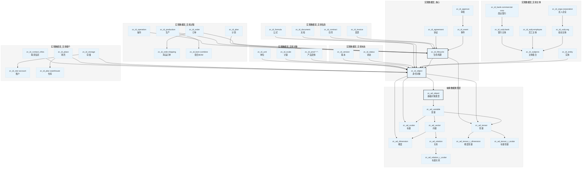

# Alioth

[](LICENSE)
[](https://github.com/CosmicTools9/Alioth/issues)
[](https://github.com/CosmicTools9/Alioth/stargazers)
[](Version)

## 📋 目录

- [项目定位](#项目定位)
- [核心特性](#核心特性)
- [数学模型](#数学模型)
- [安装](#安装)
- [使用指南](#使用指南)
- [理论背景](#理论背景)
- [贡献指南](#贡献指南)
- [许可证](#许可证)
- [致谢](#致谢)
- [支持与联系](#支持与联系)

## 项目定位

Alioth 是基于数学群论和对称性原理构建的企业级数据本体建模框架，专门用于标准化经济行为的表达与分析。该框架利用交易对称性原理和同构群结构，为数字化应用开发提供统一的数据标准、流程规范和行为特征。

Alioth 致力于实现以下目标：

- **数据标准化**：为各类数字化应用提供统一的数据模型和交互标准
- **流程规范化**：基于数学原理标准化交易流程
- **架构统一化**：构建可扩展、可维护的数据架构
- **数字化转型**：支持各类经济行为主体数字化转型过程中的数据治理和应用重构
- **成本优化**：通过标准化降低数字化应用的开发和维护成本

## 核心特性

### 交易对称性

- **数学基础**：基于群论和对称操作的经济行为形式化描述
- **守恒原理**：确保经济系统中的价值守恒和交易可逆性
- **可验证性**：通过数学证明验证交易的正确性和完整性

### 同构群结构

- **统一建模**：使用群论框架统一表示经济主体和交易关系
- **结构保持**：保持经济系统在变换下的结构不变性
- **层次化组织**：通过子群和同态映射组织复杂经济关系

### 通用数据模型

- **场景适应性**：适用于多种经济场景和交易类型
- **类型安全**：基于严格数学类型系统的数据建模
- **可组合性**：支持模块化组合和扩展

### 数学严谨性

- **代数基础**：基于群论、范畴论等现代数学理论
- **形式化验证**：支持数学证明和形式化验证
- **一致性保证**：确保数据模型的一致性和完整性

### 可扩展架构

- **插件化设计**：支持自定义经济规则和行为模式
- **渐进式扩展**：支持从简单到复杂的渐进式建模
- **标准化接口**：提供标准化的扩展接口和协议

## 数学模型

### 交易对称性原理

Alioth 模型的核心是交易对称性原理，将经济行为视为对称操作。这种对称性保证了经济系统的守恒性和可逆性。

#### 基本交易代数

```
交易 T: A(M) ↔ B(D)

其中：
- A, B ∈ G（经济主体群）
- M, D ∈ Z（可交易权益群）
- T ∈ Hom(A, B)（交易态射集）
```

#### 对称性条件

```
∀ T ∈ Hom(A, B), ∃ S ∈ Aut(G) 使得：
S(T) = T' ∈ Hom(B, A)
且 S² = id（对合性）
```

#### 群论表达

经济系统建模为群 G，其中：

- **群元素**：经济主体 {A, B, C, ...}
- **群操作**：交易组合 ∘: Hom(A,B) × Hom(B,C) → Hom(A,C)
- **单位元**：零交易 1_A ∈ Hom(A,A)
- **逆元**：对称交易 T⁻¹ ∈ Hom(B,A)

#### 范畴论表达

范畴 C：

- 对象：Ob(C) = 经济主体集合
- 态射：Hom(A,B) = A 到 B 的交易集合
- 复合：交易序列的组合
- 恒等：1_A: A → A（无交易或自交易）

#### 具体代数表达式

对于交易 T: A → B（金额为 m，商品为 c）：

```
T = (sender: A, receiver: B, amount: m, commodity: c)
S(T) = (sender: B, receiver: A, amount: m, commodity: c)
```

#### 守恒定律

```
∑_{A∈G} endowment_A(t) = constant
```

交易对称性保证经济系统的总价值守恒，这种代数表达使得经济行为可以用严格的数学语言描述，便于形式化分析和计算。

### 同构群结构

经济系统被建模为同构群 G：

#### 群结构定义

- **群元素**：表示经济主体（企业、个人、组织等）
- **群操作**：表示交易行为的组合和变换
- **子群**：表示经济子系统（部门、业务单元等）
- **同态映射**：表示经济关系和经济变换

#### 结构保持性

同构群结构确保经济系统在变换下保持其基本性质：

- **结构不变性**：经济关系在对称变换下保持不变
- **信息完整性**：交易信息在变换过程中不会丢失
- **可追溯性**：支持交易的完整审计和追溯

## 安装

### 环境要求

- **数据库**：PostgreSQL 14.x+
- **操作系统**：Linux、macOS、Windows
- **权限**：数据库管理员权限

### 快速开始

#### 1. 克隆项目

```bash
git clone https://github.com/CosmicTools9/Alioth.git
cd Alioth
```

#### 2. 安装数据库

**macOS（使用 Homebrew）：**

```bash
brew install postgresql
brew services start postgresql
```

**Ubuntu/Debian：**

```bash
sudo apt update
sudo apt install postgresql postgresql-contrib
sudo systemctl start postgresql
```

**Windows：**

下载并安装 [PostgreSQL for Windows](https://www.postgresql.org/download/windows/)

#### 3. 初始化数据库

```bash
# 导入数据模型
psql -h localhost -U postgres -d postgres -f init.ddl
psql -h localhost -U isahl -d "isahl_9.x" -f alioth.ddl
```

#### 4. 验证安装

```bash
# 连接数据库验证
psql -h localhost -U postgres -d "isahl_9.x" -c "SELECT version();"
```

## 使用指南

Alioth 框架采用基于群论和范畴论的分层数据模型，核心包括抽象数据类型层（zc_ad_*）和实现数据层（zc_id_*）。

### 核心概念

#### 抽象数据类型层（Abstract Data）

抽象数据类型层提供数学建模的基础构件：

| 类型 | 说明 | 继承关系 |
|------|------|----------|
| zc_ad_object | 基础对象类型 | 根类型 |
| zc_ad_variable | 变量，包含数据类型和编码 | 继承 object |
| zc_ad_vector | 向量，包含维度计数 | 继承 variable |
| zc_ad_dimension | 维度，包含分量引用 | 继承 vector |
| zc_ad_relation | 关系，连接两个对象 | 继承 vector |
| zc_ad_scalar | 标量，零维向量 | 继承 variable |
| zc_ad_tensor | 张量，多维数组 | 继承 variable |

#### 实现数据层（Implement Data）

实现数据层在抽象类型基础上实现具体业务要素，zc_id_* 表示业务要素的具体数据实现：

| 类型 | 说明 | 继承关系 |
|------|------|----------|
| zc_id_object | 业务要素实现根类型 | 继承 variable/tensor/dimension |
| zc_id_lifecycle | 生命周期实现 | 继承 tensor, object |
| zc_id_contract | 合同实现 | 继承 lifecycle |
| zc_id_event | 事件实现 | 继承 lifecycle |
| zc_id_approve | 审批流程实现 | 继承 event |

### 模型范畴分类

Alioth 数据模型按照交易活动的六个核心范畴进行组织，每个范畴对应经济活动的一个维度。

#### 交易主体

交易主体是指参与经济活动的实体，包括自然人、法人、组织等。

| 对象类型 | 说明 | 典型对象 |
|----------|------|----------|
| 基础实体 | 实体根类型 | zc_id_entity |
| 主体集合 | 主体管理 | zc_id_subjects |
| 组织机构 | 企业、部门、集团 | zc_id_orga-corporation, zc_id_orga-department, zc_id_orga-group |
| 人员 | 员工、代理人 | zc_id_empl-natural, zc_id_empl-agent |
| 法人主体 | 银行、企业 | zc_id_corp-airline, zc_id_corp-insurer, zc_id_bank-central |

#### 交易媒介

交易媒介是指价值转移的渠道和载体。

| 对象类型 | 说明 | 典型对象 |
|----------|------|----------|
| 支付账户 | 银行、现金、渠道账户 | zc_id_stor-acc-bank, zc_id_stor-acc-cash |
| 存储介质 | 集装箱、容器 | zc_id_stor-container, zc_id_stor-ctn-box |
| 通讯信息 | 电话、邮件、地址 | zc_id_info-telephone, zc_id_info-email |
| 地理场所 | 仓库、港口、机场 | zc_id_plac-warehouse, zc_id_plac-shipping_port |

#### 交易对象

交易对象是指交易的标的物，包括产品、商品、服务等。

| 对象类型 | 说明 | 典型对象 |
|----------|------|----------|
| 产品 | 销售、采购、制成产品 | zc_id_prod-sales, zc_id_prod-purchase, zc_id_prod-made |
| 物料 | 原材料、资金、库存 | zc_id_inve-materials, zc_id_inve-money |
| 计量 | 金额、价格、重量 | zc_id_scal-amount, zc_id_scal-price |
| 单位 | 货币、重量、体积单位 | zc_id_unit-currency, zc_id_unit-weight |
| 比率 | 税率、折扣率 | zc_id_rati-tax, zc_id_rati-discount |

#### 交易过程

交易过程是指交易从发生到完成所经历的生命周期和流程。

| 对象类型 | 说明 | 典型对象 |
|----------|------|----------|
| 生命周期 | 基础生命周期 | zc_id_lifecycle, zc_id_agreement, zc_id_event |
| 流程 | 项目、采购、服务流程 | zc_id_process, zc_id_proc-project, zc_id_proc-purchase |
| 订单 | 海运、空运、零售订单 | zc_id_orde-shipping, zc_id_orde-airlift, zc_id_orde-retail |
| 计划 | 采购、制造、项目计划 | zc_id_plan-purchase, zc_id_plan-making, zc_id_plan-project |
| 生产 | 制造、BOM管理 | zc_id_production, zc_id_bom-combine, zc_id_bom-assemble |
| 操作 | 付款、交付、仓储操作 | zc_id_oper-payment, zc_id_oper-delivery |
| 审批 | 审批事件、工作流 | zc_id_even-approve, zc_id_appr-purchase |

#### 交易信息

交易信息是指交易过程中产生和使用的各类数据和文档。

| 对象类型 | 说明 | 典型对象 |
|----------|------|----------|
| 发票 | 电子、形式、税务发票 | zc_id_invo-electric, zc_id_invo-proforma |
| 合同 | 销售、采购、代理合同 | zc_id_cont-sales, zc_id_cont-purchase |
| 单据 | 订单明细、提交明细 | zc_id_deta-trade_order, zc_id_deta-commit |
| 凭证 | 收付款凭证 | zc_id_smt-voucher |
| 会计 | 日记账、会计科目 | zc_id_coun-acc-journal, zc_id_cate-acc-title |
| 文档 | 会计账簿、文件 | zc_id_docu-acc-book, zc_id_file-blueprint |
| 消息 | 邮件、评论、任务反馈 | zc_id_msgs-email, zc_id_msgs-comments |
| 公式 | 计算、条件、映射公式 | zc_id_form-calculation, zc_id_calc-prod_pricing |

#### 交易状态

交易状态是指交易在生命周期中所处的阶段和状态。

| 对象类型 | 说明 | 典型对象 |
|----------|------|----------|
| 状态基础 | 状态根类型 | zc_id_status |
| 业务状态 | 计费、支付、定价状态 | zc_id_stus-billing, zc_id_stus-payment |
| 库存状态 | 仓储、库位状态 | zc_id_stus-inventory, zc_id_stus-bin_location |
| 生产状态 | 制成、采购、销售状态 | zc_id_stus-prod-made, zc_id_stus-prod-sales |
| 订单状态 | 运输、零售状态 | zc_id_stus-shipping_order, zc_id_stus-retail |
| 版本控制 | 版本管理 | zc_id_version, zc_id_vers-context |

### 对象关系网络

模型通过命名规范表达对象之间的关系。

#### 关系类型标识

| 后缀 | 含义 | 示例 |
|------|------|------|
| _r | 多对一关系 | zc_id_lifecycle_r_status（生命周期与状态） |
| _rr | 多对多关系 | zc_id_bom_rr_item（BOM与物料） |

#### 核心关系网络

**主体关系网络**

```
zc_id_entity
└── zc_id_subjects
    ├── zc_id_subj-employee (员工)
    │   └── zc_id_subj-org_rr_employee (组织-员工关系)
    ├── zc_id_subj-org (组织)
    │   └── zc_id_orga-corporation (法人企业)
    └── zc_id_subj-bank (银行)
```

**订单关系网络**

```
zc_id_order
├── zc_id_orde-shipping / zc_id_orde-retail
├── zc_id_order_rr_obj-rep (订单-对象代表关系)
└── zc_id_order_rr_recv_invoice (订单-收票关系)
```

**财务关系网络**

```
zc_id_invoice
├── zc_id_payment_rr_invoice (支付-发票关系)
└── zc_id_contract (合同)
    └── zc_id_cont-sales / zc_id_cont-purchase
```

### 设计原则

#### 继承层次

模型采用 PostgreSQL 表继承机制：

- 根对象：zc_ad_object → zc_id_object
- 张量对象：zc_ad_tensor → zc_id_lifecycle
- 向量对象：zc_ad_vector → zc_ad_relation

#### 命名规范

| 前缀 | 含义 |
|------|------|
| zc_ad_* | 抽象数据类型 |
| zc_id_* | 实现数据（业务要素具体化） |
| meta_* | 元数据/系统数据 |
| *_r_* | 关系表 |
| *_rr_* | 多对多关系表 |

### 表继承关系

Alioth 模型采用 PostgreSQL 表继承机制构建分层数据结构，从抽象数据类型逐步特化到具体业务对象。zc_id_object 的一阶继承表表述了业务要素如何被分类实现。



#### 继承层次说明

| 层次 | 类型 | 说明 |
|------|------|------|
| 第零层 | zc_ad_object | 根类型，包含通用字段（id, created_at, updated_at等） |
| 第一层 | zc_ad_variable, zc_ad_vector, zc_ad_tensor | 添加数据类型和编码 |
| 第二层 | zc_id_object | 业务要素实现根类型，一阶继承表定义分类实现 |
| 第三层 | zc_id_lifecycle | 添加业务流程编号和序列 |
| 第四层 | 具体业务对象 | 特定业务场景的完全特化 |

#### 多继承机制

模型支持多继承，部分表同时继承多个父类型：

```sql
-- 示例：产品同时继承多个特性
CREATE TABLE isahl."zc_id_prod-sales" 
INHERITS (isahl.zc_id_prod-combine, isahl.zc_id_prod-traffic);
```

这种设计使得对象可以同时具备多种特性，如销售产品同时具备"组合"和"运输"特性。

## 理论背景

### 数学基础

Alioth 模型建立在坚实的数学理论基础之上：

#### 群论 (Group Theory)

- **对称性分析**：描述经济系统的对称性和结构不变性
- **群操作**：定义经济行为的组合和变换规则
- **子群理论**：组织复杂经济系统的层次结构

#### 范畴论 (Category Theory)

- **关系建模**：提供经济关系的严格形式化框架
- **函子理论**：支持经济系统间的映射和变换
- **自然变换**：描述经济行为的等价性和相似性

#### 博弈论 (Game Theory)

- **策略分析**：分析经济主体间的策略互动和均衡
- **合作博弈**：研究经济主体间的合作机制
- **信息不对称**：处理经济信息的不确定性和信息差异

#### 信息论 (Information Theory)

- **信息度量**：量化经济信息的不确定性和熵
- **编码理论**：优化经济信息的表示和传输
- **信道容量**：分析经济信息传递的效率和限制

### 核心参考文献

模型的理论基础参考了以下重要研究领域：

1. **对称性经济学**——将物理学的对称性原理应用于经济系统分析
2. **代数经济学**——使用代数方法建模复杂经济系统
3. **网络群论**——基于群论的经济网络结构分析
4. **范畴论应用**——范畴论在社会科学和经济建模中的应用

## 贡献指南

我们热烈欢迎各种形式的贡献！Alioth 的成功离不开社区的参与和支持。

### 问题报告

如果您遇到任何问题，请 [创建 issue](https://github.com/CosmicTools9/Alioth/issues) 并提供：

**必需信息：**

- 问题的详细描述和重现步骤
- 期望行为与实际行为的对比
- 相关错误日志或截图
- 环境信息（操作系统、数据库版本等）

**可选信息：**

- 可能的原因分析
- 相关的代码片段
- 已经尝试的解决方案

### 功能请求

有改进 Alioth 的想法？我们很乐意听取！[提交功能请求](https://github.com/CosmicTools9/Alioth/issues) 时请包含：

**功能描述：**

- 功能的清晰描述和使用场景
- 预期收益和解决的问题
- 相关的业务需求背景

**技术细节：**

- 建议的实现方案
- 相关的数学理论基础
- 参考的类似实现或研究

### 代码贡献

我们欢迎代码贡献！请遵循以下流程：

1. **Fork 项目**并创建功能分支
2. **编写测试**确保代码质量
3. **遵循代码规范**保持一致性
4. **提交 Pull Request**并详细描述变更

### 文档贡献

文档改进同样重要：

- 修正错误或模糊的描述
- 添加使用示例和最佳实践
- 翻译或本地化文档
- 创建教程和指南

## 许可证

本项目采用 **MIT 许可证**——详见 [LICENSE](LICENSE) 文件。

MIT 许可证允许您自由地使用、复制、修改、合并、出版发行、散布、再授权及售卖本软件，唯一的限制是必须包含原始许可证声明。

## 致谢

Alioth 项目的成功离不开以下方面的支持：

### 贡献者

感谢所有为项目做出贡献的开发者和用户，你们的反馈和建议让 Alioth 不断完善。

### 学术基础

项目受到以下领域的交叉研究启发：

- 经济学中的对称性原理应用
- 数学群论在复杂系统建模中的运用
- 范畴论在社会科学中的创新应用

### 开源社区

感谢开源社区提供的宝贵工具和库，特别是 PostgreSQL 数据库和相关数学计算库。


### 社区支持

- **[GitHub Discussions](https://github.com/CosmicTools9/Alioth/discussions)**——技术讨论和社区交流
- **[GitHub Issues](https://github.com/CosmicTools9/Alioth/issues)**——bug 报告和功能请求

### 商业支持

- **电子邮件**：support@cosmic-tools.ltd
- **官方网站**：[CosmicTools](https://cosmic-tools.ltd)

### 学术合作

我们欢迎学术机构和研究人员的合作，共同推进经济建模理论的发展。

---

**Alioth**——基于数学对称性的企业级数据建模框架

由 [CosmicTools](https://cosmic-tools.ltd) 团队用爱打造

版本：v9.0.3 | 最后更新：2025年9月
