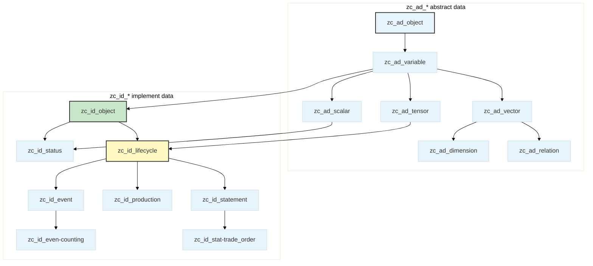

# Alioth

[](LICENSE)
[](https://www.postgresql.org/)
[](README.md)

基于 **PostgreSQL 表继承** 的企业数据模型，以范畴论与交换本体论为理论基础。Alioth 将经济行为形式化为*交换范畴*中的态射：可逆交易构成一个**群胚**（groupoid），其上配备对合对称函子（每笔可逆交易都有镜像逆交易，`S² = id`）；每个业务实体在 4 维正交空间 `(Scene, Factor, Function, Status)` 中占据唯一坐标——为企业数据管理提供数学上严格的基础。

最新模型版本以 [`latest.json`](latest.json) 为锚点。最新发布（`v10.0.27`，2026-09-17）包含 **972 张继承表**（13 张 `zc_ad_*` 抽象表 + 959 张 `zc_id_*` 实现表）与 **254 张种子表**，已在专用验证库上通过全量重建验证。

---

## 仓库布局（Repository Layout）

发布模型按 **版本** 存放于本仓库。每次发布写入一个版本目录 `v{major}.{minor}.{patch}/`：

```
Alioth/
├── latest.json                     # 最新版本锚点：version、published_at、逐表种子行数、文件清单
└── v10.0.28/                       # 每个已发布版本一个目录（SemVer）
    ├── 001_schema.sql              # CREATE SCHEMA IF NOT EXISTS isahl
    ├── 002_isahl_tables.sql        # isahl schema 结构（纯 CREATE/ALTER，后处理产物；972 张表）
    ├── seed-dimensions.sql         # 254 张维度/类目/状态/字典表的种子数据
    ├── seed-dimensions.meta.json   # 各种子表预期行数（用于验证）
    ├── seed-model-contract.sql     # 模型级种子契约（声明的种子表集合，幂等）
    ├── model-contract.json         # 本次发布的机读模型契约
    ├── verify-report.json          # 重建验证报告（验证运行后落盘）
    └── README.md                   # 版本内 README（导出时间戳、pg_dump 版本）
```

---

## 快速开始（Quick Start）

### 前置条件

- PostgreSQL 14+
- `isahl` 列引用的 `isahl_meta` 类型定义必须存在（枚举/域在验证阶段从源数据库注入；标准部署随 schema 一并下发）。

### 安装

```bash
git clone https://github.com/CosmicTools9/Alioth.git
cd Alioth
VERSION=$(jq -r .version latest.json)   # 或选择具体版本目录
psql "$DATABASE_URL" -f "$VERSION/001_schema.sql"
psql "$DATABASE_URL" -f "$VERSION/002_isahl_tables.sql"
psql "$DATABASE_URL" -f "$VERSION/seed-dimensions.sql"
psql "$DATABASE_URL" -f "$VERSION/seed-model-contract.sql"
```

文件必须 **按顺序** 执行：schema → tables → seed data → seed contract。

### 验证

```sql
-- 表计数（v10.0.27 预期值）
SELECT count(*) FROM pg_tables WHERE schemaname='isahl' AND tablename LIKE 'zc\_ad\_%';  -- 13
SELECT count(*) FROM pg_tables WHERE schemaname='isahl' AND tablename LIKE 'zc\_id\_%';  -- 959

-- 维度种子数据加载
SELECT code, notice FROM isahl.zc_id_scene LIMIT 10;
```

---

## 模型架构（Model Architecture）

### 继承层级

Alioth 使用 PostgreSQL 表继承，构建从抽象数学类型到具体业务对象的分层体系。表名前缀：`zc`（项目前缀）、`ad` = **抽象数据**（abstract data）、`id` = **实现数据**（implement data）。



| 层级 | 前缀 | 根表 | 角色 | 字段特征 |
|---|---|---|---|---|
| L0 抽象 | `zc_ad_` | `zc_ad_object` | 所有对象之根 | `id`, `created_at`, `updated_at` |
| L1 语义 | `zc_ad_` | `zc_ad_variable` | 增加语义标识 | `code`, `notice` |
| L2 结构 | `zc_ad_` | `zc_ad_scalar` / `zc_ad_vector` / `zc_ad_tensor` / `zc_ad_dimension` | 按数学结构分化 | `mark`、`precision_`（scalar）等 |
| L3 关系 | `zc_ad_` | `zc_ad_relation` | 两个实体间的有向连接 | `ref_left`, `ref_right` |
| L4 实现 | `zc_id_` | `zc_id_object` | **业务元素根**——一阶继承定义分类实现 | `o_number`、`comments` |
| L5 生命周期 | `zc_id_` | `zc_id_lifecycle` | 生命周期轨迹 + 本体坐标 | `dk_scene` / `dk_factor` / `dk_function`、`_f_` / `_t_`、`tpl_id`、`o_number` |
| L6+ 叶子 | `zc_id_` | `zc_id_stat-trade_order`、`zc_id_orde-land`、`zc_id_even-counting` … | 具体业务场景 | 全部继承字段 + 业务专属列 |

### 3D 坐标系

每个生命周期实体在 `isahl` 空间中占据唯一坐标 `(Scene, Factor, Function)`——三个维度 **完全正交**（积范畴：各维度独立取值）：

| 维度 | DB 列 | 引用 | 含义 |
|---|---|---|---|
| Scene | `dk_scene` | `zc_id_scene` | 交换发生的业务上下文（*在哪里* 发生交易） |
| Factor | `dk_factor` | `zc_id_factor` | 参与交换的主体/媒介/客体（*谁* 与 *什么* 交易） |
| Function | `dk_function` | `zc_id_function` | 交换不同阶段与层级的操作（*如何* 完成交易） |

三个维度基类均继承自 `zc_ad_dimension`。每个维度的 `code` 由 **分类前缀 + 序列符号** 自动拼接（如 `JC` = 系统管理），由 INSERT/UPDATE 触发器生成。

### 五域完备性（LCGPF）

Factor 维度划分为五个域，对应任何完整交换不可或缺的五个视角：

| 代码 | 域 | 元素 | 经济角色 |
|---|---|---|---|
| L | Labor | 参与方子群 | 谁交易 |
| C | Container | 媒介/容器子群 | 什么承载价值 |
| G | Goods | 标的子群 | 交易什么 |
| P | Place | 位置子群 | 在哪交易 |
| F | Finance | 流程与信息子群 | 价值如何流动 |

域归属经 `ck_category` → `zc_id_cons-factor-cate.a_type_` 推导。完整交换快照 **必须** 覆盖全部五个域——形式化表述：领域映射的像覆盖 `{L, C, G, P, F}`（不允许对称性破缺），由模型推理引擎在生成期强制。

### 生命周期状态表达

业务对象生命周期状态的离散投影通过关系表表达（实体行自身不携带状态列）：

```
zc_id_lifecycle_r_primary-status → zc_id_stus-*       主状态（领域状态叶表；单调，如 出生→死亡）
zc_id_lifecycle_r_status         → zc_id_status       一般状态（双向，如 在职↔请假）
zc_id_lifecycle_r_tags           → zc_id_tags         标签
zc_id_lifecycle_r_category       → zc_id_category     分类
```

主状态链是全序集——离散逻辑时间；`status_date` 将其对齐到物理时间。过去与未来的时间切片关于*现在*互为镜像：`zc_id_event`（已发生）↔ `zc_id_task`（待发生），任务完成即切片翻转为事件。

---

## 命名规约（Naming Conventions）

### 表级

| 后缀 | 关系类型 | 示例 |
|---|---|---|
| `{entity}_r_{target}` | 一对多关系表（`ref_right` 唯一：每个子恰属一父） | `zc_id_lifecycle_r_status` |
| `{entity}_rr_{target}` | 多对多桥接表（span：两端均可重复） | `zc_id_bom_rr_item` |

关系表携带 `ref_left`（引用方）与 `ref_right`（被引用方）列。

### 列级

| 前缀 | 含义 | 示例 |
|---|---|---|
| `dk_*` | 本体坐标 → `zc_ad_dimension` 族 | `dk_scene`, `dk_factor`, `dk_function` |
| `qk_*` | 标量引用键 → `zc_id_scale` 继承体系（`zc_id_scal-*` 叶表） | `qk_price`, `qk_amount` |
| `fk_*` | 生命体引用 | `fk_country` |
| `sk_*` | 单位引用 | `sk_unit`（指向计量单位表） |
| `ck_*` | 分类/类别引用 | `ck_category` |
| `tk_*` | 标签引用 | `tk_batch_no`（单选标签） |
| `lk_*` | 级别/等级引用 | `lk_level` |
| `tpl_id` | 实例 → 范例桥接 | 固定列名 |

> `_f_` 与 `_t_` 列由 `dk_function.code` 前缀自动派生（六种形式：`!.` / `!_` / `↑.` / `↑_` / `↓.` / `↓_` → 创意 / 设计 / 实现 × 范例 / 实例——阶段 × 抽象层级的积结构），永不暴露在业务层 DTO 中。

---

## 关键设计决策（Key Design Decisions）

### ID 生成

| 表类型 | 函数 |
|---|---|
| `zc_id_lifecycle` 及其全部子表 | `isahl.gen_next_zuid()` — 全局唯一 ID |
| 非生命周期业务表 | `isahl.gen_next_uid(table_code)` — 确定性 ID |
| `isahl_meta` 元数据表 | `BIGSERIAL` |

继承表通过独立的 `ALTER COLUMN id SET DEFAULT` 语句绑定各自的生成器，避免多重继承场景下的冲突。

### 标量引用模型

所有可测量的连续量（金额、日期、数量、价格）**不**以原生类型存储于业务表，而是通过标量引用表传递——值对象外化方案：相等值共享同一行：

```
business_table.qk_price (bigint) → zc_id_scal-price.id → zc_id_scal-price.mark (numeric)
business_table.qk_date  (bigint) → zc_id_scal-date.id  → zc_id_scal-date.date  (timestamptz)
```

| 前缀 | 标量表 | 实际值列 |
|---|---|---|
| `qk_date` | `zc_id_scal-date` | `date` (timestamptz) |
| `qk_amount` | `zc_id_scal-amount` | `mark` (numeric) |
| `qk_price` | `zc_id_scal-price` | `mark` (numeric) |
| `qk_qty` | `zc_id_scal-common` | `mark` (numeric) |
| 其他 `qk_*` | `zc_id_scale` 继承层级 | `mark` (numeric) |

**硬性约束**：所有 `qk_*` 列在 DDL 中均为 `bigint`。禁止定义为 `Decimal`、`DateTime` 或 `String`——实际类型化值存储在被引用的标量行上（含 `sk_unit` 单位与 `precision_` 精度）。

### 列可写性

| 类别 | 可写性 | 典型列 |
|---|---|---|
| 🚫 系统生成 | 不可见且不可写 | `id`, `created_at`, `updated_at`, `deleted_at` |
| 🔒 维度/触发器派生 | 不暴露于 DTO | `o_number`, `domain_`, `_f_`, `_t_`, `dk_*`, `paths` |
| ✅ 用户可写 | 直接出现在 DTO | `notice`, `code`, `comments`, `qk_*`, `fk_*`, `ck_*`, `tk_*` |

---

## 模型发布（Model Publishing）

每个版本目录由模型发布管道产出：

1. 通过 `pg_dump --schema-only` 从权威数据库导出 `isahl` schema（外加 254 张种子表的数据导出）。
2. 后处理为 **纯 CREATE/ALTER** 形式：剥离仅运行时语句，内联 `id` 列 DEFAULT 提取后以 `ALTER TABLE ... ALTER COLUMN id SET DEFAULT isahl.gen_next_uid(...)` 语句重新应用，按继承深度拓扑排序，使每个继承表绑定自己的生成器。
3. 在本仓库写入版本目录（含机读契约 `model-contract.json` / `seed-model-contract.sql`）并更新 `latest.json`。
4. **重建验证**（非阻断）：在专用干净验证库上，删除 `isahl` / `isahl_auth` / `isahl_audit` 后按顺序以 `ON_ERROR_STOP=1` 重放 SQL 文件，再断言种子表行数（逐表与发布快照往返一致）、`gen_next_uid` 唯一性（0 冲突、0 缺失）与结构往返（972 表集合与源库一致）。报告落盘为版本目录中的 `verify-report.json`；验证通过后版本标记为 `verified`。

版本遵循 [SemVer](https://semver.org/)。版本只增不减，下限为 `v10.0.0`。发布记录（版本、描述、输出目录、文件清单、状态）记录于 `isahl_meta.model_publish_records`。

---

## 贡献（Contributing）

Alioth 模型通过版本化发布演进。DDL 兼容性问题或模型改进建议请通过 [Issues](https://github.com/CosmicTools9/Alioth/issues) 提交。

---

## 许可证（License）

[MIT](LICENSE) © 2025-2026 宇器科技(CosmicTools.ltd) & CosmicTools Team

---

**Alioth** — 数学基础的企业数据本体

宇器科技（CosmicTools）团队用心构建
